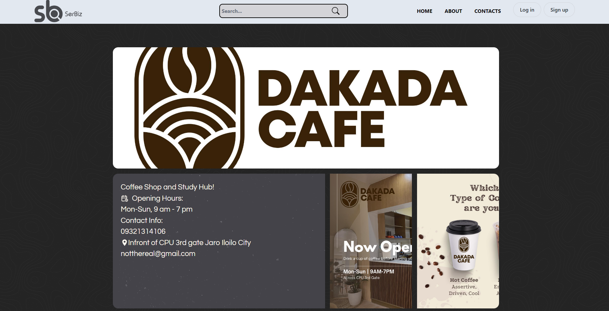

<!-- PROJECT LOGO -->
 

  <h1 align="center"></h1>
    

<!-- ABOUT THE PROJECT -->

## About The Project

SerBiz is a web app catalogue that aims to provide up-to-date information about Local Businesses and allow for
a preview of the business aesthetic, location,
price points via Catalogue Images along with the
provided information.

## Features:

•Client Users(Business owners) can create an account which will allow them to add their business in the catalogue 
•Client Users can create their own business type tag along with the pre-made tag types. 
•Users can create an account to allow them to leave comments or suggested edits for the businesses. 
•Users can easily browse the catalogue's Newest/Trending/Random section.  
•Users can also search for a specific business or businesses along with price, distance, operating hours search filters. 

## Wireframe

Wireframe link: https://www.figma.com/file/QYvon6k1nhOfNU3gdMYdMY/WIREFRAME-for-Capstone-Project(SerBiz)?type=design&node-id=0-1&t=CH5ECRYGCCS3hJN6-0

(<a href="#readme-top">back to top</a>)

### This Project is Built With

  
  
  
  
  
  
  
 

(<a href="#readme-top">back to top</a>)

<!-- GETTING STARTED -->

# Getting Started with Create React App

This is an example of how you may give instructions on setting up your project locally.
To get a local copy up and running follow these simple example steps.

This project was bootstrapped with [Create React App](https://github.com/facebook/create-react-app).

## Available Scripts

In the project directory, you can run:

### `npm start`

Runs the app in the development mode.\
Open [http://localhost:3000](http://localhost:3000) to view it in your browser.

The page will reload when you make changes.\
You may also see any lint errors in the console.

### `npm test`

Launches the test runner in the interactive watch mode.\
See the section about [running tests](https://facebook.github.io/create-react-app/docs/running-tests) for more information.

### `npm run build`

Builds the app for production to the `build` folder.\
It correctly bundles React in production mode and optimizes the build for the best performance.

The build is minified and the filenames include the hashes.\
Your app is ready to be deployed!

See the section about [deployment](https://facebook.github.io/create-react-app/docs/deployment) for more information.

## Learn More

You can learn more in the [Create React App documentation](https://facebook.github.io/create-react-app/docs/getting-started).

# express-postgres

# Libraries and Packages Used

- [Express](https://www.npmjs.com/package/express)
- [express-postgres](https://node-postgres.com/)
- [dotenv](https://www.npmjs.com/package/dotenv)
- [body-parser](https://www.npmjs.com/package/body-parser)

## psql shell commands

- `\c database_name` - to connect
- `\l` - shows all databases
- `\d` - shows all tables in database
- `\?` - shows all commands
- `\h` - shows queries you can use
- `q` - will allow to leave the list / quit

more commands here: [psql commands](https://www.javatpoint.com/psql-commands)

## SQL Commands

- Create Database - `CREATE DATABASE database_name;`
- Create Table - `CREATE TABLE table_name (column_1 datatype, column_2 datatype, column_3 datatype);`
- Read/Get/Retrieve
  - `SELECT * FROM table_name`;
  - `SELECT any_attribute FROM table_name`;
- Update Data/Row - `UPDATE table_name SET column_1 = value_1, column_2 = value_2, … WHERE condition;`
- Delete Data/Row - `DELETE FROM table_name WHERE condition;`

more commands here: [SQL commands](https://www.freecodecamp.org/news/basic-sql-commands/)

(<a href="#readme-top">back to top</a>)

<!-- USAGE EXAMPLES -->

## Webapp Sample

(<a href="#readme-top">back to top</a>)

<!-- CONTRIBUTING -->

## Contributing

Contributions are what make the open source community such an amazing place to learn, inspire, and create. Any contributions you make are **greatly appreciated**.

If you have a suggestion that would make this better, please fork the repo and create a pull request. You can also simply open an issue with the tag "enhancement".
Don't forget to give the project a star! Thanks again!

1. Fork the Project
2. Create your Feature Branch (`git checkout -b feature/AmazingFeature`)
3. Commit your Changes (`git commit -m 'Add some AmazingFeature'`)
4. Push to the Branch (`git push origin feature/AmazingFeature`)
5. Open a Pull Request

(<a href="#readme-top">back to top</a>)

<!-- LICENSE -->

## License

Distributed under the MIT License. See `LICENSE.txt` for more information.

(<a href="#readme-top">back to top</a>)

<!-- CONTACT -->

## Contact

[Linkedin]()

Project Link: [https://github.com/PenPa0/ser-biz.git](https://github.com/PenPa0/ser-biz.git)

(<a href="#readme-top">back to top</a>)

<!-- ACKNOWLEDGMENTS -->

## Acknowledgments

Here are some of the things that I enjoyed using in this project!

- [TailwindComponents](https://tailwindcomponents.com/)
- [Flowbite](https://flowbite.com/)
- [React-select](https://react-select.com/home)
- [React-toastify](https://fkhadra.github.io/react-toastify/introduction/)
- [React Icons](https://react-icons.github.io/react-icons/search)
- [Background](https://www.toptal.com/designers/subtlepatterns/)

(<a href="#readme-top">back to top</a>)

